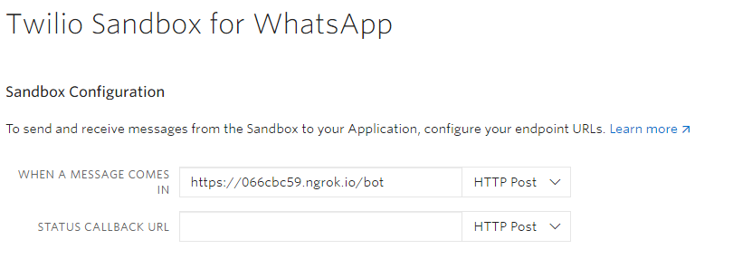

# python-whatsapp-bot
This is a Whatsapp Chatbot that responds with quotes or images of cats when either of them is requested.

[](https://twitter.com/intent/tweet?text=Create%20a%20whatsapp%20chatbot%20with%20python%20and%20Twilio.&url=https://github.com/Ileriayo/python-whatsapp-bot&via=ileriayodavid&hashtags=chatbot,ai,python,twilio,developers)

# Usage
1. Download and install [Python](https://www.python.org/). Version 3 and above should come with `pip`.

2. Clone or fork this repository (project).
    ```
    $ git clone https://github.com/Ileriayo/python-whatsapp-bot.git

    $ cd python-whatsapp-bot
    ```

2. Create a [virtual environment](https://packaging.python.org/guides/installing-using-pip-and-virtual-environments/) inside this project directoy e.g.,
    ```
    python -m venv whatsapp-bot-venv
    ```
    Then activate that environment:
    ```
    Windows: whatsapp-bot-venv\Scripts\activate

    Mac: $ source whatsapp-bot-venv/bin/activate
    ```

4. Install the following dependencies: `twilio, flask, requests`.
    ```
    $ pip install twilio flask requests
    ```

5. Run the Flask application  
    Start by setting (exporting) the FLASK_APP environment variable
    ```
    Windows: set FLASK_APP=bot.py
    Mac: $ export FLASK_APP=bot.py
    ```
    Run this command afterwards:
    ```
    python -m flask run
    ```

6. Test the chatbot. 

    a. Download [ngrok](https://ngrok.com/download). From your CLI (terminal or CMD), navigate to the ngrok directory and run this command:

        $ ngrok http 5000
    
    Copy the URL where you see `Forwarding`. It will look like this `https://066cbc59.ngrok.io`.
    

    b. Create an account on [Twilio](https://www.twilio.com) and navigate to the [Whatsapp Sandbox](https://www.twilio.com/console/sms/whatsapp/sandbox). Follow the instructions from Twilio to get a test whatsapp account.
    At the end of the setup, paste the url you copied earlier into the input field with the label `WHEN A MESSAGE COMES IN`. At the end of the URL, add '`/bot`' and hit save.

    See the screenshot below:

    

    **Bonus:** You can create a customized link for your Whatsapp chatbot. Use this template: `http://wa.me/<phone-number-from-twilio>?text=<code-to-join-sandbox>`.

    Send the link to your friends to try out the chatbot.

# Technologies Used
- Python, Flask framework
- Twilio
- ngrok

# Author
Ileriayo Adebiyi

# Like It?
- Kindly star this repository🙏🥺. It will go a long way. Thanks!🤝
- [Click to tweet](https://twitter.com/intent/tweet?text=Create%20a%20whatsapp%20chatbot%20with%20python%20and%20Twilio.&url=https://github.com/Ileriayo/python-whatsapp-bot&via=ileriayodavid&hashtags=chatbot,ai,python,twilio,developers)

# Contact
Send me an [email](mailto:ileriayoadebiyi@gmail.com?subject=Build%20Me%20a%20Chatbot) to build a bespoke chatbot for unique business needs. Visit [my website](https://ileriayo.netlify.app/)

    
# License 
See [license](LICENSE)
